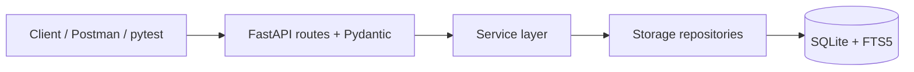

# Messenger Lab 2 — Implementation

Implementation of a minimal messenger system for the **Software Design and Documentation** course. Built on the design produced in Lab 1 (Variant 9 — Message Search & History).

## Features

**Mandatory minimum:**
- Create users
- Create direct conversations
- Send messages
- Retrieve conversation history with cursor-based pagination
- Persistent storage (SQLite)
- Modular three-layer code structure
- Typed error responses

**Variant 9 — Search & History:**
- Full-text search over message text via SQLite FTS5
- Filter by conversation or sender
- Offset-based pagination, results ranked by `bm25`

## Tech Stack

- Python 3.11+
- FastAPI + Pydantic v2
- SQLite (stdlib `sqlite3`) with FTS5
- pytest + httpx TestClient
- uvicorn

## Architecture



Layering rules:
- `api/` depends on `services/`, `models/`. Never on `storage/`.
- `services/` depends on `storage/`, `models/`. Never on `api/`.
- `storage/` depends on `models/` only.

## How to Run

```powershell
py -m venv .venv
.venv\Scripts\Activate.ps1
py -m pip install -e ".[dev]"

py main.py
# → http://127.0.0.1:8000
# → Swagger UI: http://127.0.0.1:8000/docs
```

Configuration via environment variables:

| Var                   | Default          |
|-----------------------|------------------|
| `MESSENGER_DB_PATH`   | `./messenger.db` |
| `MESSENGER_LOG_LEVEL` | `INFO`           |
| `MESSENGER_HOST`      | `127.0.0.1`      |
| `MESSENGER_PORT`      | `8000`           |

## API Reference

| Method | Path                              | Purpose                       |
|--------|-----------------------------------|-------------------------------|
| POST   | `/users`                          | Create a user                 |
| GET    | `/users`                          | List users                    |
| POST   | `/conversations`                  | Create a direct conversation  |
| POST   | `/messages`                       | Send a message                |
| GET    | `/conversations/{id}/messages`    | History (with `limit`, `before`) |
| GET    | `/messages/search`                | FTS search (`q`, `conversationId`, `senderId`, `limit`, `offset`) |
| GET    | `/health`                         | Health check                  |

Error envelope: `{ "error": "<code>", "message": "<text>" }`.

## Project Structure

```
app/
├── api/         # FastAPI routes, Pydantic DTOs, exception handlers
├── services/    # business logic + domain error hierarchy
├── storage/     # raw sqlite3 repositories
├── models/      # frozen dataclasses (domain types)
└── db/          # schema.sql with FTS triggers

tests/           # pytest + TestClient
main.py          # uvicorn entry point
postman_collection.json
docs/superpowers/specs/2026-05-15-messenger-lab2-design.md
```

## Testing

```powershell
py -m pytest -v
```

Each test gets an isolated SQLite file via `tmp_path`. The mandatory integration test lives at `tests/test_integration.py`.

For manual API testing, import `postman_collection.json` into Postman and click **Run** — all 9 requests (happy path + error cases) should be green.
